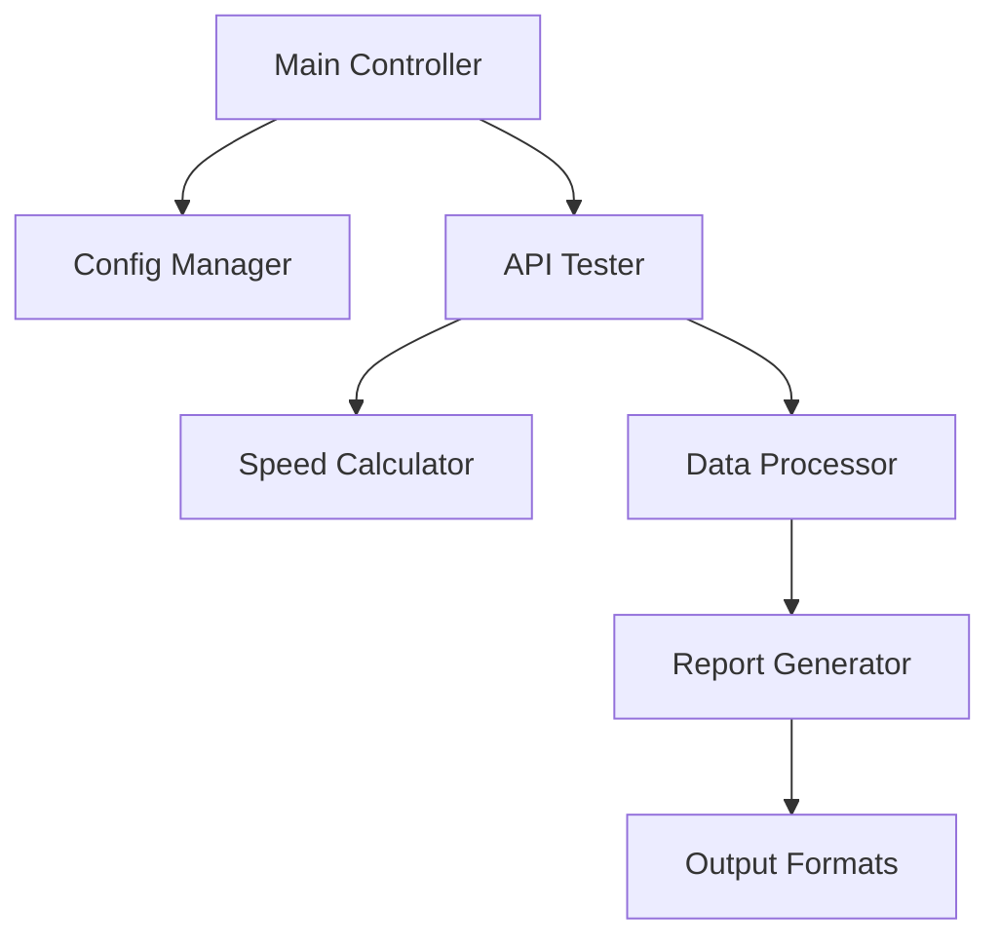
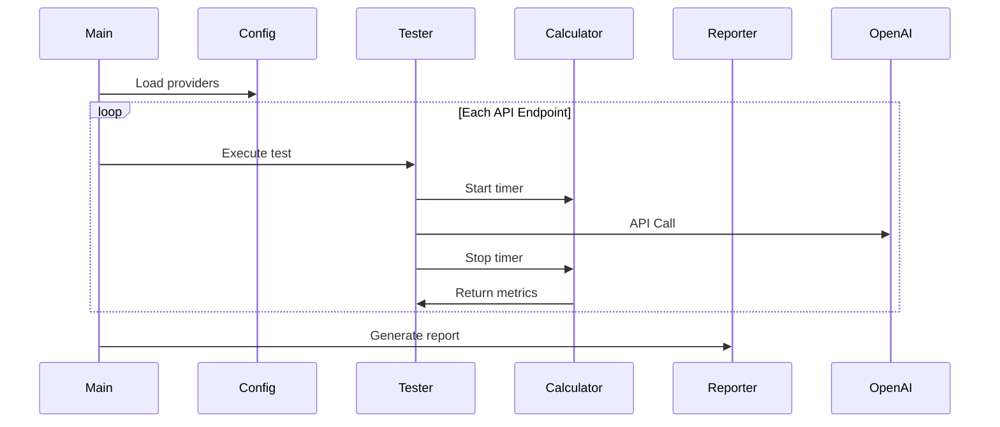

---

# 大模型API测速工具技术文档

## 1. 项目架构概览


## 2. 代码文件依赖矩阵
| 核心模块        | 依赖项                          | 被依赖项               |
|-----------------|---------------------------------|-----------------------|
| config_manager  | config.yaml                     | api_tester, main      |
| api_tester      | openai, config_manager          | speed_calculator      |
| speed_calculator| time, tokenizer                 | data_processor        |
| data_processor  | pandas, numpy                   | report_generator      |
| report_generator| matplotlib, csv                 | main                  |

## 3. 功能调用时序流程


## 4. 关键代码文件索引
| 文件路径               | 核心功能                                                                 |
|------------------------|--------------------------------------------------------------------------|
| /config/config.yaml    | 存储API密钥、模型列表、测试参数                                         |
| core/speed_calculator.py | 时间测量、token计数、速度计算公式实现                                   |
| services/api_tester.py | OpenAI SDK调用封装、异常处理、上下文管理                                |
| reports/report_generator.py | 生成CSV/Markdown报告、可视化图表绘制                                   |
| main.py                | 命令行参数解析、测试流程控制                                            |

## 5. 设计模式与规范约定

### 架构模式
```tabular
| 模式          | 应用场景                     | 实现示例                     |
|---------------|----------------------------|----------------------------|
| 单例模式       | 配置管理器                  | ConfigManager.instance()   |
| 工厂模式       | 测试用例生成                | TestCaseFactory.create()   |
| 装饰器模式     | 执行时间测量                | @timed_execution           |
```

### 编码规范
1. **命名约定**：
   - 服务商代码：全小写+下划线 (e.g. `azure_openai`)
   - 模型标识符：厂商前缀+模型名称 (e.g. `openai:gpt-4-turbo`)

2. **类型提示**：
```python
def calculate_tps(
    response: openai.types.Completion, 
    duration: float
) -> tuple[float, int]:
```

3. **配置文件结构**：
```yaml
providers:
  openai:
    api_key: sk-***
    models:
      - name: gpt-4
        params:
          temperature: 0.7
          max_tokens: 1000
```

### 性能测量标准
```math
TPS = \frac{TotalTokens_{prompt} + TotalTokens_{completion}}{T_{response} - T_{request}}
```